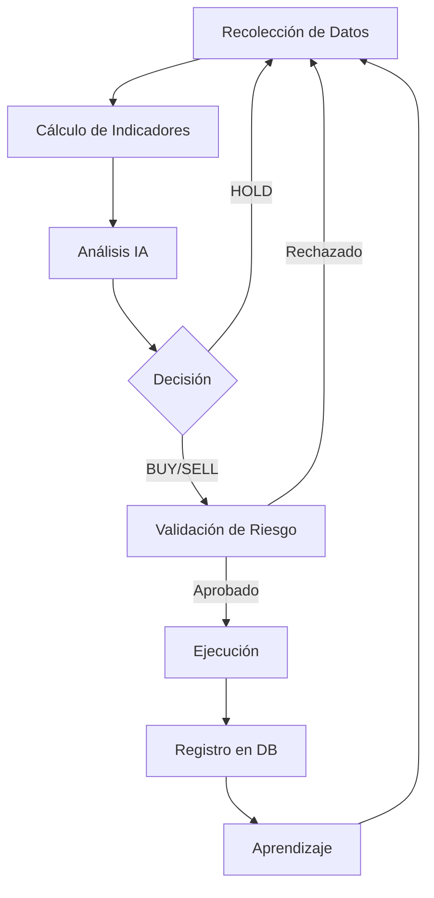

# 🚀 Binance Crypto AI Agent

> **Crypto AI Trading Bot** - Sistema de Trading Automatizado con Inteligencia Artificial

Sistema avanzado de trading automatizado para criptomonedas que combina **análisis técnico** con **inteligencia artificial** (LLMs locales) para tomar decisiones de trading informadas en tiempo real.

---

## 🌟 Características Principales

### 🤖 Inteligencia Artificial
- **Modelos LLM locales** (Ollama/LM Studio) - Sin dependencia de APIs externas
- **Aprendizaje continuo** - El sistema aprende de cada operación realizada
- **Análisis contextual** - Considera patrones históricos y condiciones de mercado
- **Múltiples modelos** - Soporte para diferentes modelos (Qwen2.5, Llama3.2, DeepSeek)

### 📊 Análisis Técnico Multi-Timeframe
| Timeframe | Propósito |
|-----------|-----------|
| **1h** | Análisis detallado |
| **4h** | Tendencia general |

**Indicadores Implementados:**
- ✅ **RSI** (14 períodos) - Detección de sobrecompra/sobreventa
- ✅ **EMA 9/20** - Cruce para determinar régimen de mercado
- ✅ **MACD** (12,26,9) - Confirmación de momentum
- ✅ **Trend Strength** - Fuerza de la tendencia actual

### 🎯 Gestión de Riesgo Avanzada
| Parámetro | Valor | Descripción |
|-----------|-------|-------------|
| Stop Loss | 1.0% | Configurable |
| Take Profit | 1.5% | Configurable |
| Confianza mínima | 70% | Para ejecutar operaciones |

- 🔒 **Órdenes OCO** (One-Cancels-Other) - Protección automática
- 📊 **Máximo de slots** - Control de posiciones simultáneas
- 💰 **Detección de balance mínimo** - Prevención de liquidación

### 📈 Backtesting y Live Trading
- 📜 **Backtesting histórico** - Datos reales de Binance Mainnet
- ⚡ **Live Trading** - Ejecución en tiempo real (Testnet/Mainnet)
- 🧪 **Modo Dry Run** - Simulación sin riesgo
- 🔄 **Soporte SPOT y FUTURES** - Con apalancamiento configurable

### 💾 Base de Datos y Persistencia
- 🗄️ **SQLite** para almacenamiento local
- 📝 **Decisiones registradas**: Timestamp, dirección, confianza, hipótesis
- 📊 **Outcomes tracking**: Entry/Exit, PnL, precisión
- 📈 **Model Stats**: Estadísticas agregadas por modelo

### 🖥️ Dashboard en Tiempo Real
- ⚡ **FastAPI** backend moderno y rápido
- 🔌 **WebSocket** para logs en vivo
- 📊 **Visualización de**:
  - Modelos entrenados
  - Sesiones de trading
  - Decisiones históricas
  - Estadísticas de precisión
  - Posiciones abiertas
  - Trades recientes

### 🧠 Sistema de Aprendizaje Automático
- 🔄 **Feedback loop**: Últimas 3 decisiones en cada análisis
- ⏱️ **Horizonte temporal**: Análisis de precisión a 1h, 4h, 24h
- 🔍 **Pattern recognition**: Identificación de patrones exitosos/fallidos
- 💡 **Insights automáticos**:
  - Suficiencia de datos
  - Limitaciones del modelo
  - Recomendaciones accionables
  - Brechas de datos

---

## 📋 Requisitos

### Software
- **Python** 3.11+
- **SQLite3**
- **Ollama** o **LM Studio** (para LLM local)

### Modelos Recomendados
| Modelo | Descripción |
|--------|-------------|
| **Qwen2.5-3B** | ⭐ Recomendado - Balance calidad/rendimiento |
| **Llama3.2-3B** | Alternativa |
| **DeepSeek-R1** | Máxima calidad |

---

## 🚀 Instalación

### 1. Clonar repositorio
```bash
git clone https://github.com/tu-usuario/binance_crypto-ai-agent.git
cd binance_crypto-ai-agent
```

### 2. Configurar variables de entorno
```bash
cp .env.example .env
# Editar .env con tus credenciales
```

### 3. Configurar LLM local
```bash
# Descargar e instalar Ollama
curl -fsSL https://ollama.com/install.sh | sh

# Pull del modelo recomendado
ollama pull qwen2.5:3b

# Iniciar Ollama
ollama serve
```

### 4. Instalar dependencias
```bash
pip install -r requirements.txt
```

---

## 📖 Uso

### Backtesting
```bash
python backtesting.py
```

### Live Trading
```bash
python main.py
```

### Dashboard
```bash
cd dashboard
python app.py
# Acceder a http://localhost:8000
```

---

## ⚙️ Configuración

### `config.json` - Parámetros Principales

```json
{
  "trading": {
    "symbol": "BTCUSDT",
    "timeframe": "1h",
    "confirmation_timeframe": "4h",
    "stop_loss_pct": 1.0,
    "take_profit_pct": 1.5,
    "min_confidence": 70,
    "max_slots": 3
  },
  "llm": {
    "provider": "ollama",
    "model": "qwen2.5:3b",
    "base_url": "http://localhost:11434"
  },
  "binance": {
    "api_key": "TU_API_KEY",
    "api_secret": "TU_API_SECRET",
    "testnet": true
  },
  "risk": {
    "auto_exit_enabled": false,
    "position_size_pct": 5.0,
    "max_daily_trades": 10
  }
}
```

---

## 📊 Estructura del Proyecto

```
binance_crypto-ai-agent/
├── agents/              # Agentes de IA y lógica de decisión
├── dashboard/           # Interfaz web y API
├── data/                # Datos históricos y caché
├── db/                  # Base de datos y modelos
├── execution/           # Ejecución de órdenes
├── risk/                # Gestión de riesgo
├── scripts/             # Scripts utilitarios
├── backtesting.py       # Módulo de backtesting
├── config.py            # Configuración
├── constants.py         # Constantes del sistema
├── main.py              # Punto de entrada principal
├── trainer.py           # Entrenamiento y aprendizaje
└── requirements.txt     # Dependencias
```

---

## 🔍 Cómo Funciona

### Flujo de Decisión



1. **Recolección de Datos**: Obtiene velas 1h y 4h de Binance
2. **Cálculo de Indicadores**: RSI, EMA, MACD, Trend Strength
3. **Análisis IA**: Envía snapshot al LLM con:
   - Datos técnicos actuales
   - Últimas 3 decisiones y resultados
   - Reglas de trading
4. **Decisión**: BUY/SELL/HOLD con nivel de confianza
5. **Validación de Riesgo**: Verifica:
   - Confianza >= mínimo configurado
   - Balance suficiente
   - Slots disponibles
6. **Ejecución**:
   - Si `AUTO_EXIT_ENABLED=false`: Coloca órdenes OCO (TP/SL)
   - Si `AUTO_EXIT_ENABLED=true`: IA decide cuándo cerrar
7. **Registro**: Guarda decisión y outcome en SQLite
8. **Aprendizaje**: Próxima decisión incluye feedback

### Sistema de Aprendizaje

Cada decisión se almacena con:
- 📅 Timestamp y contexto de mercado
- 🎯 Dirección (BUY/SELL) y confianza
- 📊 Indicadores en el momento (RSI, regime, trend)
- 💹 Resultado (PnL, was_correct)

El sistema analiza:
- 📈 Precisión por horizonte (1h, 4h, 24h)
- 🔍 Patrones exitosos (ej: BUY con RSI<40 en bullish)
- ❌ Patrones fallidos (ej: SELL en bullish fuerte)
- 🎲 Calibración de confianza (¿80% confianza = 80% aciertos?)

---

## 📈 Métricas y Estadísticas

El dashboard muestra:

| Métrica | Descripción |
|---------|-------------|
| **Win Rate** | % de operaciones ganadoras |
| **PnL Total** | Ganancia/pérdida acumulada |
| **Precisión por RSI** | Rendimiento por zona de RSI |
| **Precisión por Tendencia** | Rendimiento por tipo de tendencia |
| **Buy/Sell Analysis** | Comparativa BUY vs SELL |
| **Horizonte Temporal** | Precisión a 1h, 4h, 24h |

---

## ⚠️ Advertencias de Riesgo

> **IMPORTANTE**: Este software es solo para fines **educativos y de investigación**.

- ⚠️ El trading de criptomonedas conlleva **alto riesgo de pérdida**
- 💸 Nunca inviertas más de lo que puedas permitirte perder
- 📉 El rendimiento pasado no garantiza resultados futuros
- 🧪 Prueba exhaustivamente en **Testnet** antes de usar **Mainnet**
- 📝 El autor **no se responsabiliza** por pérdidas financieras

---

## 🤝 Contribuciones

Las contribuciones son bienvenidas:

1. 🍴 Fork el proyecto
2. 🌿 Crea una rama (`git checkout -b feature/AmazingFeature`)
3. 💾 Commit tus cambios (`git commit -m 'Add AmazingFeature'`)
4. 📤 Push a la rama (`git push origin feature/AmazingFeature`)
5. 🔀 Abre un Pull Request

---

## 📝 Roadmap

- [ ] Soporte para múltiples pares simultáneos
- [ ] Estrategias personalizables via YAML
- [ ] Telegram/Discord notifications
- [ ] Análisis de sentimiento de noticias
- [ ] Machine Learning avanzado (scikit-learn)
- [ ] Optimización de parámetros genética
- [ ] Soporte para más exchanges (KuCoin, Bybit)

---

## 📄 Licencia

Distribuido bajo la licencia **MIT**. Ver [LICENSE](LICENSE) para más información.

---

## 📞 Contacto

- 🐛 **GitHub Issues**: Para bugs y feature requests
- 💬 **Discussions**: Para preguntas generales

---

<div align="center">

**Desarrollado con ❤️ para la comunidad crypto**

⭐ ¡Si te gusta este proyecto, dale una estrella! ⭐

</div>
